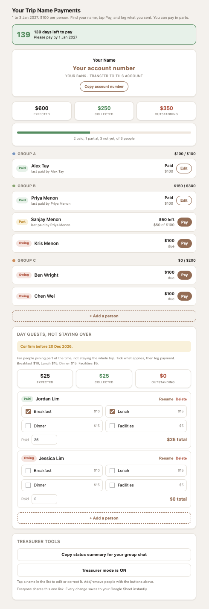

# Trip Treasurer

A small payment tracker for group trips where one person collects money upfront and everyone else needs to see, at a glance, what they owe and what they've paid. One shared link, no app to download, no accounts to make.

I built this to be treasurer for a big family trip, chasing 25+ people for payment updates over WhatsApp was chaos. This fixed it. Sharing it in case it's useful for yours too.

## Why not just use Splitwise?

Splitwise is built for a different problem: ongoing, reciprocal expenses between people who owe each other a bit each, roommates, couples, that kind of thing. This is for the treasurer problem instead: one person fronts money for a shared trip or event and collects from a group, and everyone else needs a zero-friction way to check their balance and log a payment, without signing up for anything. If you're the one fronting a deposit for a big family trip, a friend group holiday, or a reunion, that's a different shape of problem, and this fits it better.

## What it does

- One shared link, no login required for guests
- People log their own payments, in parts if they want
- Optional track for people joining for only part of the trip, paying per item instead of the full cost
- Treasurer mode, PIN-protected, to add, edit, or remove people
- One-tap summary of who's paid and who hasn't, ready to paste into your group chat
- Data lives in a Google Sheet in your own Drive. You own it completely, nothing goes through a third-party server

## Setup, about 10 minutes

This is plain Google Apps Script. No build step, no hosting to set up, it deploys straight from your Google account.

1. Go to **script.google.com**, signed in as whichever Google account you want to own this.
2. Click **New project**.
3. You'll see a file called `Code.gs`. Select all, delete it, paste in the entire contents of `Code.gs` from this repo.
4. Add the page file: next to "Files," click **+**, then **HTML**. Name it exactly `Index` (capital I, no `.html`). Delete the placeholder content and paste in the entire contents of `Index.html` from this repo.
5. Press Cmd+S (or Ctrl+S) to save.
6. Click **Deploy**, **New deployment**.
7. Click the gear icon next to "Select type" and choose **Web app**.
8. Set:
   - **Execute as**: Me
   - **Who has access**: **Anyone** — important, so your group can open it without logging in
9. Click **Deploy**, then **Authorize access** and pick your account. You'll see a warning that Google hasn't verified the app, that's normal for your own script, click **Advanced** then **Go to (your project) (unsafe)**, then **Allow**.
10. Copy the **Web app URL**. That's your link, share it in the group chat.

The first time anyone opens the link, it automatically creates a Google Sheet called "Trip Treasurer (data)" in your Drive. That's your master record.

## Customize before you deploy

Open `Code.gs` and edit the `CONFIG` object at the top:

| Field | What it is |
|---|---|
| `eventName`, `eventDates` | shown in the page title and subtitle |
| `currency` | your currency symbol, e.g. `$`, `RM`, `£` |
| `perPerson` | default amount each new person owes |
| `payName`, `bank`, `account` | where people send money |
| `qrImageUrl` | optional, a hosted image URL of your payment QR. Leave blank to show account details only |
| `deadlineDate` | `YYYY-MM-DD`, when payments are due |
| `treasurerPin` | change this to your own secret number before deploying |

Below that, edit the `GROUPS` array to rename or add the groups you're splitting people into (families, rooms, cars, whatever makes sense for your trip).

The app starts with no one added. Once it's deployed, unlock treasurer mode from inside the app and add people from there.

## To change anything later

Edit `Code.gs` or `Index.html` in the Apps Script editor, save, then **Deploy → Manage deployments → pencil icon → Version: New version → Deploy**. The link stays the same.
